# Top 12 Men's Gift Box Websites Ranked in 2025 (Latest Compilation)

Finding the perfect gift for the guy in your life shouldn't feel like navigating a maze blindfolded. Whether he's into tactical gear, gourmet snacks, or stylish accessories, specialized gift box websites have cracked the code on delivering exactly what men actually want. These platforms curate themed boxes packed with gear, gadgets, grooming essentials, and unique finds that take the guesswork out of gift-giving while delivering genuine excitement when he opens the package.

The men's gift box industry has evolved beyond generic gift baskets into a sophisticated ecosystem of specialized retailers offering everything from survival gear subscriptions to artisan food crates. These services understand that modern men appreciate quality, functionality, and a touch of adventure in their gifts, whether it's for birthdays, holidays, or just because.

***

## **[Man Crates](https://www.mancrates.com)**

The original crowbar-required gift experience that turns unboxing into an event.

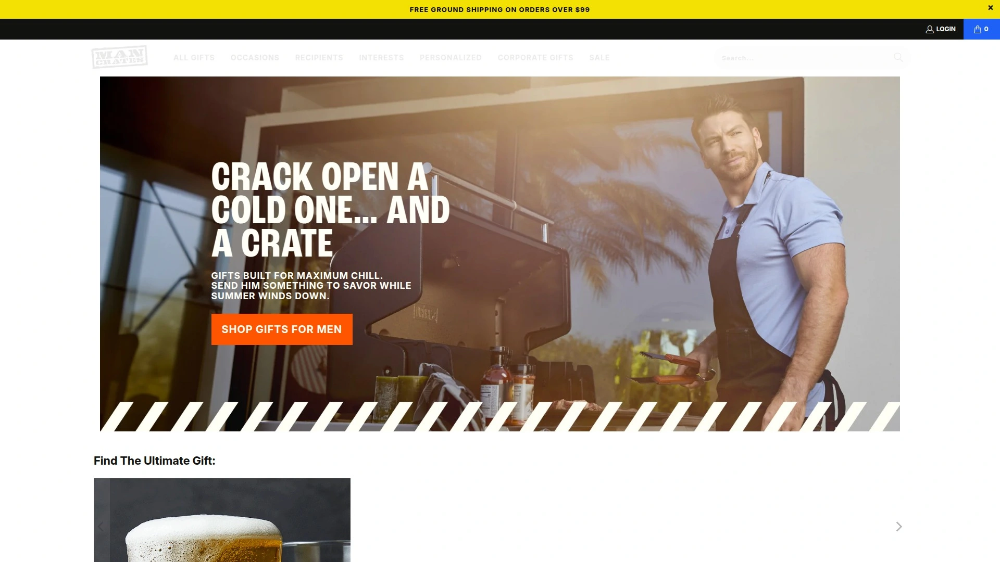

Man Crates pioneered the concept of packing premium gifts for men into actual wooden crates that require a crowbar to open, transforming the gift-giving moment into a memorable experience. Each crate is thoughtfully curated around specific interests, from grilling masters to whiskey enthusiasts, with categories spanning eating, drinking, outdoor adventures, sports, and DIY projects. The brand distinguishes itself by offering gifts in rugged containers like wooden crates, ammo cans, concrete bricks, and puzzle boxes that double as keepsakes long after the contents are enjoyed.

Their bestselling collections feature everything from premium jerky assortments to personalized golf putting mats, all designed to eliminate the stress of shopping for hard-to-please guys. Man Crates promises a "High-Five Guarantee" ensuring customer satisfaction, with responsive support ready to make things right if expectations aren't met. The company ships nationwide and has built a reputation for packing genuine value into each crate, with products guys will actually use rather than generic filler items.

For anyone seeking gifts that feel personal without requiring hours of research, Man Crates delivers curated excellence across dozens of themed collections, making it the go-to destination for memorable gifts men appreciate.

***

## **[Bespoke Post](https://www.bespokepost.com)**

Monthly themed boxes curated from small brands with skip-anytime flexibility.

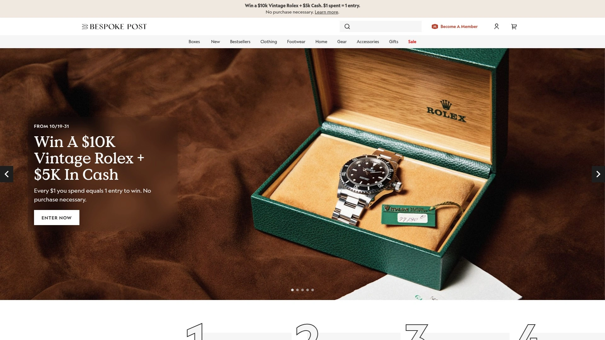

Bespoke Post operates as a lifestyle subscription service that partners with emerging makers and small brands to deliver themed "Box of Awesome" packages every month for $49. What sets this platform apart is the preview-and-swap model, allowing subscribers to see next month's box in advance and either keep it, swap for a different theme, or skip entirely without penalty. Categories range from outdoor survival kits and kitchen upgrades to grooming tools, EDC gear, and home decor, ensuring there's something for every male interest and lifestyle.

Each box arrives packed with full-sized products rather than samples, introducing subscribers to quality brands they might never discover otherwise. The marketplace also allows direct purchases of individual items without committing to the subscription model. Subscribers gain access to exclusive deals and member-only pricing on premium outdoor gear, making the membership valuable beyond the monthly boxes.

The service excels at helping friends and family find thoughtful gifts for men who seem to have everything, with themes like "Grounds" for outdoor enthusiasts and "Laced Up" for the style-conscious gentleman.

***

## **[Mantry](https://mantry.com)**

Artisan food subscription delivering America's best small-batch products in handmade wooden crates.

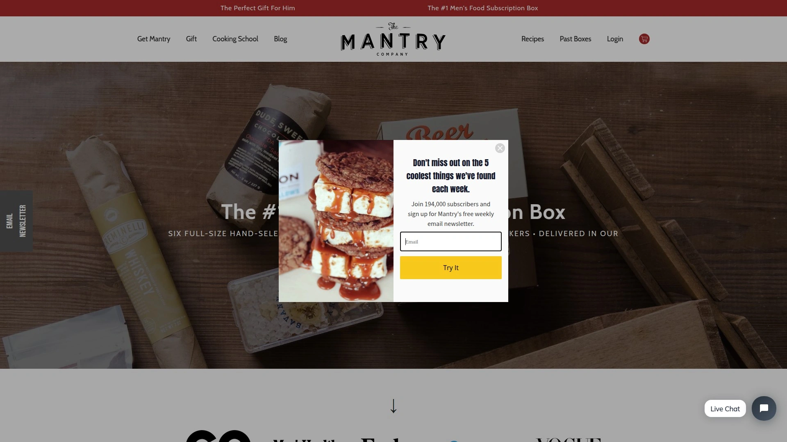

Mantry positions itself as "The Modern Man's Pantry," shipping six full-sized artisan food products every two months in signature handmade wooden crates. Each delivery centers around culinary themes like "Taco Night," "Morning Ritual," or "Bourbon BBQ," sourcing items from top American food makers across the country, from Charleston BBQ sauce to Montana bison jerky. The crates include detailed manuals with product stories and recipes, helping even novice cooks elevate their kitchen game.

What distinguishes Mantry from typical food subscriptions is the genuine curation quality—products are selected for excellence rather than weight or shipping convenience, resulting in genuinely premium contents that can last months. Pricing starts at $75 for a single box, with subscription options for three or six boxes offering better value. The service has earned praise from publications like Fast Company and Lauren Conrad for its thoughtful approach to gourmet gifting.

For the foodie who appreciates discovering regional specialties and small-batch craftsmanship, Mantry delivers an experience that goes far beyond standard gift baskets.

***

## **[BattlBox](https://www.battlbox.com)**

Survival and outdoor gear subscription tested by experts and featured on Netflix.

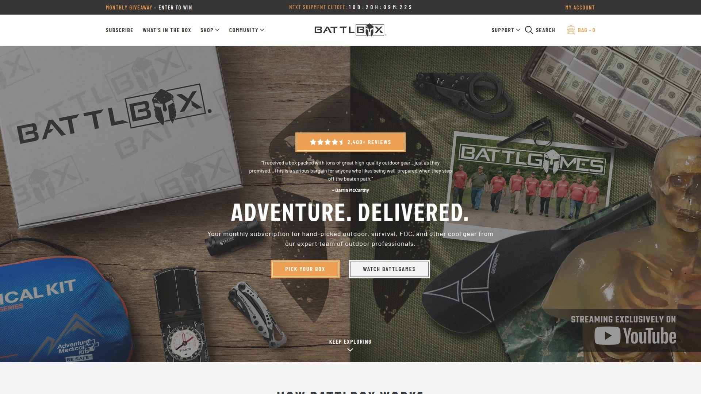

BattlBox delivers hand-selected outdoor, survival, and EDC gear monthly through a tiered subscription model ranging from $34.99 to $169.99. The team, featured on Netflix's "Southern Survival," rigorously tests each product before inclusion, ensuring subscribers receive genuinely useful gear from respected brands like TOPS Knives, Zippo, Leatherman, and Gerber. Subscription tiers progress from Basic (3-4 items like fire starters and paracord) through Pro Plus, which includes a premium knife each month.

Members gain access to the BattlVault marketplace featuring exclusive discounts on outdoor gear unavailable elsewhere, plus educational resources including blogs and instructional videos demonstrating proper gear usage. All products shipped are full-sized usable items rather than samples, designed for carrying, using, or adding to emergency preparedness stashes. The subscription has shipped over one million boxes, building a community of like-minded outdoor enthusiasts who share experiences and learn survival skills together.

For the prepared outdoorsman or survival enthusiast, BattlBox combines quality gear with practical education and community connection.

***

## **[BroCrates](https://brocrates.com)**

Same-day delivery gift baskets for men featuring beer, whiskey, and premium snacks.

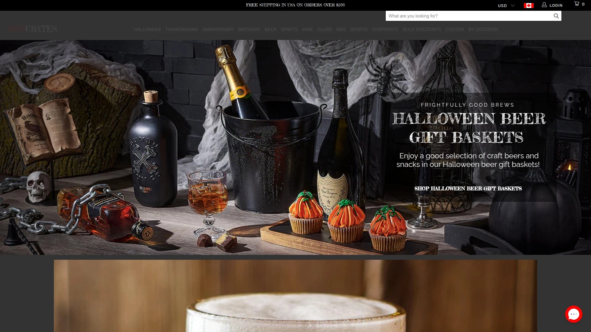

BroCrates specializes in gift baskets tailored specifically for guys, packed with beer, whiskey, wine, and gourmet snacks with free same-day delivery options. Their curated selection includes themed crates for every occasion, from bachelor parties to Father's Day, with categories spanning beer crates, whiskey crates, grooming kits, BBQ essentials, and sports-themed packages. The Beer & Nuts BroCrate exemplifies their approach, featuring six beers, creamy brie cheese, beef jerky, dry roasted pistachios, and sea salt almonds in a wooden presentation box.

The service emphasizes convenience for last-minute gifting while maintaining quality standards, with customer support available seven days a week. Recipients can customize crates with additional beer, liquor, and snacks to create truly personalized gifts. BroCrates positions itself as the destination for sports lovers and guys who appreciate straightforward, enjoyable gifts they can consume and share with friends.

For anyone needing a reliable, same-day gift solution that won't feel rushed or generic, BroCrates delivers manly indulgence in presentation-ready packages.

***

## **[Uncommon Goods](https://www.uncommongoods.com)**

Curated marketplace of unique, often artisan-made gifts with lifetime returns.

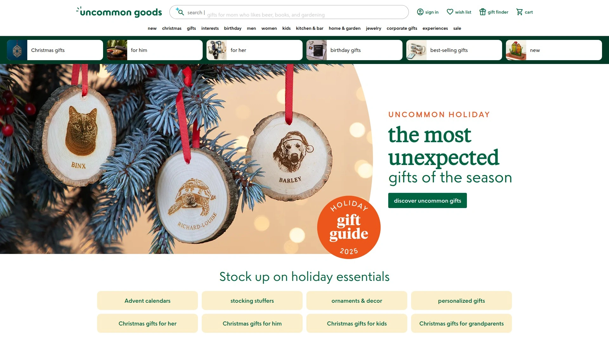

Uncommon Goods has established itself as the go-to destination for unusual, creative gifts that break free from department store predictability. Their men's collection spans over 1,400 unique gift ideas, from personalized whiskey barrels and custom map art to DIY hot sauce kits and vintage-inspired gadgets. The platform champions independent makers and artisan creators, offering products you genuinely won't find anywhere else while supporting small businesses.

The company operates as a founding B-Corporation, having donated over $3 million to various causes while maintaining ethical standards that exclude leather, feathers, and fur since 1999. Shopping features include filtering by price, interest, and hobby, plus virtual classes that can be gifted, ranging from couple's map-making to astrology readings. Their lifetime return policy demonstrates confidence in product quality and customer satisfaction.

Uncommon Goods excels at gifts for men with specific passions, offering customizable options and genuinely innovative products that show thoughtfulness rather than last-minute panic.

***

## **[Gentleman's Box](https://www.gentlemansbox.com)**

Style-focused subscription delivering ties, accessories, and grooming essentials monthly.

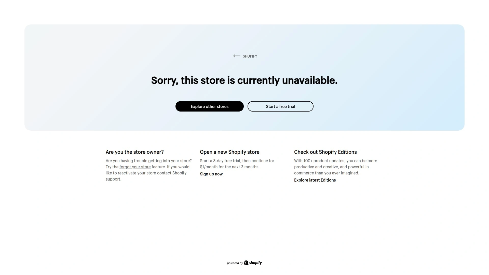

Gentleman's Box curates monthly shipments of men's fashion accessories and grooming products themed around famous gentlemen like Jack Nicholson or Jason Momoa. The Classic subscription typically features coordinated ties and socks plus rotating items like cufflinks, tie bars, lapel pins, bracelets, and quality headphones—the small details that complete an outfit but busy professionals rarely take time to purchase. Each box promises 3X value guarantee, meaning contents worth three times the subscription cost.

The quarterly Premium subscription offers a different experience entirely, featuring four to six larger items curated around themes like "Outdoorsman Edition," which might include a quality knife, portable chess board, and packable hammock. Subscribers also receive the latest issue of GQ Magazine through the brand's partnership with Condé Nast, adding style education to the physical products. The service helps style-conscious men maintain their fashion edge without dedicating hours to accessory shopping.

For the gentleman who values looking sharp but lacks time for detail shopping, Gentleman's Box delivers coordinated style solutions directly to the door.

***

## **[Touch of Modern](https://www.touchofmodern.com)**

Premium gadgets and innovative tech for the modern man's lifestyle.

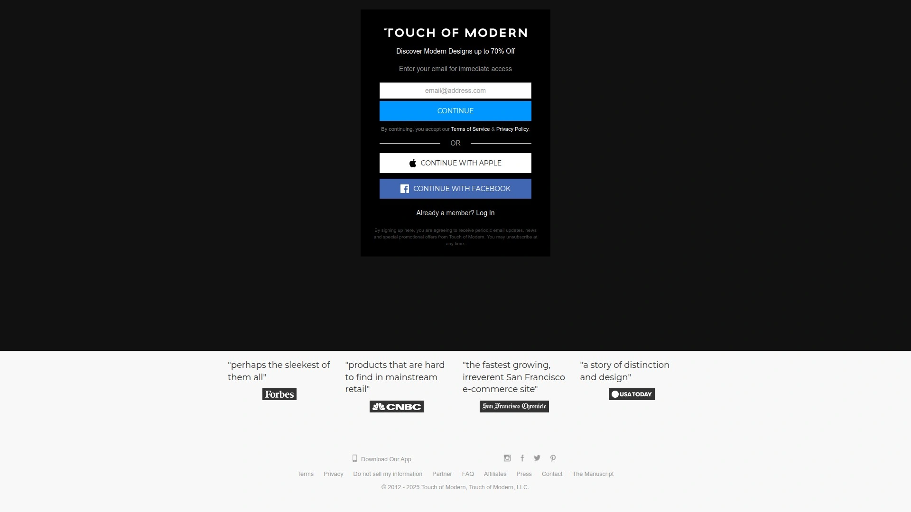

Touch of Modern operates as a members-only lifestyle platform specializing in innovative tech gadgets, smart home devices, and modern design products that blend functionality with cutting-edge aesthetics. The curated marketplace features everything from high-resolution audio systems and intelligent lighting to portable innovations and futuristic devices that offer glimpses into tomorrow's technology. Products are selected specifically for their ability to merge innovative functionality with sleek, masculine design sensibilities.

The platform discovers and showcases unique gadgets from emerging brands alongside established names, offering members access to modern designs at up to 70% off retail prices with guaranteed lowest price protection. Categories span smart home tech, portable gadgets for travel and fitness, and distinctive lifestyle products that elevate daily routines. The shopping experience emphasizes discovery, introducing the modern man to products that enhance life in unexpected ways.

Touch of Modern appeals to tech enthusiasts and early adopters who appreciate owning innovative products that combine practicality with conversation-starting design.

***

## **[Crate Club](https://crateclub.com)**

Tactical and survival gear subscription curated by Special Operations veterans.

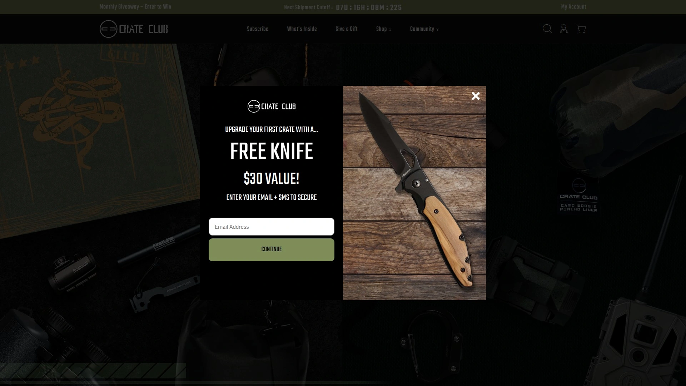

Crate Club delivers premium tactical and survival gear monthly, with boxes curated by a team of Special Operations and Military Veterans who understand field-tested quality. This expertise ensures every included item meets rigorous standards for durability and practical utility in outdoor and survival situations. Product selection emphasizes genuine tactical applications rather than recreational camping gear, featuring items like advanced handcuff keys, vehicle escape tools, and military-grade tactical pens.

The subscription model provides consistent access to specialized gear that might otherwise require extensive research to source independently. Beyond the monthly boxes, the platform offers a retail shop where members can purchase individual tactical items and accessories directly. The veteran-led curation adds credibility and practical insight that recreational outdoor subscriptions cannot match.

For those serious about tactical preparedness or with military backgrounds appreciating quality gear selection, Crate Club offers expert curation unavailable from general outdoor subscriptions.

***

## **[GQ Box](https://gqbox.com)**

Quarterly lifestyle subscription from the iconic men's magazine.

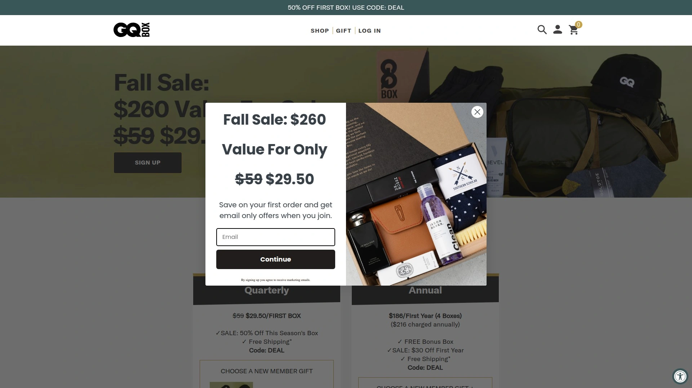

GQ Box leverages the magazine's decades of style expertise to deliver quarterly subscription boxes featuring curated men's lifestyle products. New members receive their choice of GQ-branded merch including dad hats, bucket hats, or tote bags, plus access to seasonal deals offering 50% off the first box. The quarterly model means less frequent deliveries but typically more substantial items compared to monthly subscriptions, with annual memberships including a bonus fifth box.

The brand's reputation for understanding men's style, culture, and lifestyle interests ensures curated selections align with current trends while maintaining timeless appeal. Product choices within each box allow subscribers some control over what they receive, balancing curation with personal preference. Free shipping on subscriptions adds value while keeping costs predictable.

GQ Box suits the style-conscious man who trusts the magazine's editorial judgment and prefers quarterly surprises over monthly commitments.

---

## **[Huckberry](https://huckberry.com)**

Heritage-focused outdoor and adventure gear marketplace.

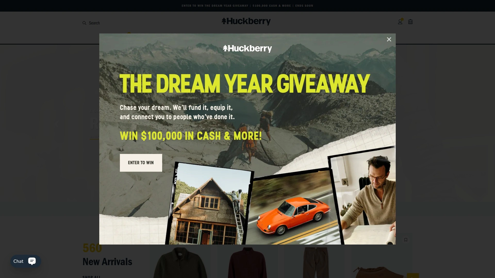

Huckberry has built a devoted following among outdoorsmen who appreciate rugged, heritage-quality gear with timeless aesthetics rather than disposable fast fashion. The platform specializes in adventure-ready clothing, camping equipment, and lifestyle products that blend functionality with classic American outdoor traditions. Product highlights include items like the 72-hour merino tee designed to stay fresh for three days without washing, making it ideal for travel and active pursuits.

Their curated selection emphasizes durability and multi-purpose functionality, featuring brands like Dyneema for technical gear and Vibram for footwear. The marketplace includes recovery tools like infrared sauna blankets for active lifestyles, portable jump starters for trail emergencies, and premium outdoor cooking equipment. Huckberry's buying team tests products extensively, ensuring recommendations come from genuine field experience rather than marketing hype.

The platform appeals to men who value quality construction, sustainable materials, and gear that improves with age rather than falls apart after seasons.

***

## **[Gifts.com](https://www.gifts.com)**

Comprehensive gift marketplace with personalization options for every occasion.

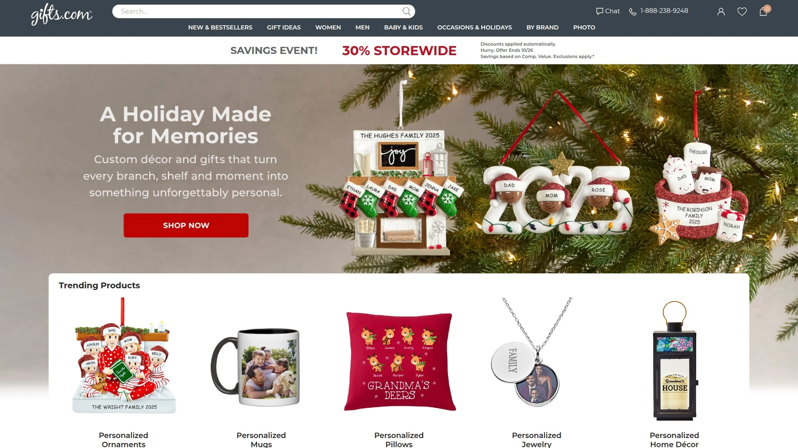

Gifts.com positions itself as the ultimate destination for gifts and keepsakes across all occasions, offering free personalization on thousands of items. The men's gift section includes extensive filtering options by price, occasion, and recipient type, making it simple to navigate their vast catalog efficiently. From birthday gifts for boyfriends to milestone celebrations, the platform covers the full spectrum of gift-giving needs with options spanning practical to sentimental.

The site emphasizes convenience through user-friendly navigation and thoughtful categorization, helping shoppers find appropriate gifts without overwhelming choice paralysis. Personalization capabilities transform standard items into meaningful keepsakes, adding thoughtful touches that demonstrate extra effort. Delivery timelines typically run 2-4 days, making the service viable even for moderately urgent gift needs.

Gifts.com works well for shoppers who prefer browsing comprehensive catalogs with good filtering tools rather than curated subscription surprises.

***

## FAQ

**How do men's gift box subscriptions typically work?**

Most services operate on monthly or quarterly schedules where you select a subscription tier based on budget and interests. You'll receive a curated box at regular intervals, with many services allowing you to preview upcoming boxes, swap themes, or skip months without penalty. One-time gift purchases are usually available if you prefer not to commit to ongoing subscriptions, making these platforms flexible for both regular self-purchases and occasional gift-giving.

**What's the typical value comparison between subscription cost and box contents?**

Quality subscription services typically deliver 2-3X the retail value of the subscription price. For example, a $49 monthly box often contains $100-150 worth of full-sized products from quality brands. Services like Gentleman's Box explicitly guarantee 3X value, while premium tiers at higher price points can deliver even greater value ratios, especially when including exclusive items unavailable at retail.

**Can I purchase from these sites without subscribing?**

Yes, most platforms featured offer both subscription models and direct marketplace shopping. Man Crates, Uncommon Goods, Touch of Modern, and Gifts.com operate primarily as retail sites where you can purchase individual items or pre-curated boxes without any subscription commitment. Even subscription-focused services like Bespoke Post and Mantry typically offer one-time gift box purchases alongside their recurring delivery options.

***

## Conclusion

The men's gift landscape has evolved far beyond generic department store options into a sophisticated ecosystem of specialized retailers that genuinely understand what guys want. From the pioneering wooden-crate experience of [Man Crates](https://www.mancrates.com) to the tactical expertise of Crate Club and the artisan food curation of Mantry, these platforms eliminate guesswork while delivering memorable unboxing moments. Man Crates remains the top choice for its versatility across interest categories, unique presentation format, and proven track record of delivering gifts that actually get used rather than forgotten in closets. Whether shopping for birthdays, holidays, or celebrating everyday wins, these twelve destinations offer reliable solutions for the eternal challenge of finding gifts men genuinely appreciate.
